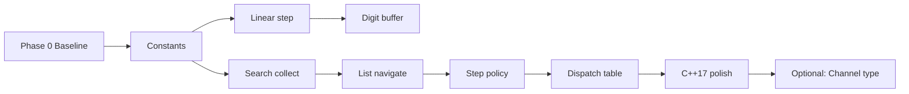

# TDD_TV

1. 셋탑박스에서 리모컨으로 부터 입력을 받아 채널을 관리하고, 튜너를 Set 하는 모듈을 만들고자 한다.

2. 리모컨에서의 입력은 숫자 0,1,2,3,4,5,6,7,8,9, 채널 업/다운, 확인, 채널검색, 선호채널추가, 다음선호채널 버튼을 통해 이루어진다.

   채널은 일반 채널 0~99 까지 있다.

3. 리모컨 센서로 부터 들어오는 입력은 아직 정해지지 않았지만, 키 값이 입력으로 들어올 것으로 여겨진다.

4. Tuner 업체에서 Channel tuner를 제공한다. 따라서 구체적인 구현이나 테스트 코드를 우리가 작성하는 상황은 아닙니다. 

    * seekCH() :  현재 채널에서 숫자가 증가하는 방향으로 시청 가능한 채널을 검색하여,  
                  채널을 검색된 채널로 변경하고 검색된 채널값을 반환한다.  
    * setCH(ch) : 지정된 채널값으로 현재 채널을 변경한다.  
    * getCurrentCH() : 현재 설정된 채널 값을 반환한다.
   
   본 실습에서 Tuner는입력에 대해 정확하게 동작한다고 가정하고 기타 개발 코드를 테스트 해야 하는 상황입니다. 
   Fake 또는 Mock을 사용하여 테스트 진행에 문제없도록 해야 합니다.     
   제공된 TunerTest.cpp를 참조한다면 Mock을 사용했을 때 필요한 기능을 좀 더 이해할 수 있습니다. Fake를 사용한 경우에도 필요한 기능을 참고할 수 있습니다.  
  
  
## TDD practice 를 적용하여, 잘 구조화된 Controller 모듈을 만들어라.
  
1. 숫자 버튼으로 채널 변경 동작
   * 리모컨 ‘1’ ‘확인’ 을 누르면 1번 채널로 변경된다.  
   * 리모컨 ‘1’을 누르고 ’2’ 를 누르면 12번 채널로 변경된다.  
   * ‘1’,’2’,’3’,’4’ 를 연속적으로 누를 경우,   
      12번 채널로 변경되었다가 34번 채널로 변경된다.  
   * ‘4’,’5’,’6’ 을 연속적으로 누를 경우: 45번 채널로 변경  
      이후 숫자와 확인 버튼을 누르면 해당 숫자의 번호로 이동(6번 또는 6_번)  
      그 외의 버튼을 누르면 6 은 무효화  
   * ‘0’,’7’ 를 누를 경우 7번 채널로 변경된다.  


2. 선호 채널 추가 버튼 동작
   * 채널 시청중에 선호채널추가를 누르는 경우  
   *    선호채널이 아닌 채널은 선호채널에 저장된다.  
   *    이미 선호채널인 채널은 선호채널에서 삭제된다.  
    
3. 다음 선호 채널 버튼 동작
   * 다음선호채널을 누르면 선호 채널 목록 내에서 현재 채널값보다 큰 값 중에서 가장 작은 값의 채널로 변경된다.  
       * 1, 4, 12, 56 이 선호채널에 저장되어 있는경우,  
       * 6번 채널 시청중 다음선호채널을 누르면 위 방향으로 가장 가까운 12로 변경된다,  
       * 56번 채널 시청중 다음선호채널을 누르면 위 방향으로 로테이션 하여 1로 변경된다.  
    
4. 채널 검색 버튼 동작
   * 리모컨 채널검색을 누르면, 모든 채널을 검색하여 저장한다.  
    
5. 업/다운 버튼 동작 : 저장된 채널 검색 결과가 없는 경우
      * 6번 채널 시청중 채널 업을 누르는 경우 7 로 변경되며,  
                     채널 다운을 누르는 경우 5 로 변경된다.  
      * 99번 채널 시청중 채널 업을 누르는 경우 0으로 변경된다.  
      * 0번 채널 시청중 채널 다운을 누르는 경우 99로 변경된다.  
  
6. 업/다운 버튼 동작 : 저장된 채널 검색 결과가 있는 경우
      * 리모컨 채널 업/다운을 누르면 저장된 채널중 다음/이전 채널로 가야 한다.  
      * 저장된 채널이 4 6 14 인 경우  
        * 채널 6을 시청중, 채널 업을 누르면 14로 변경, 다운을 누르면 4로 변경된다.  
        * 채널 15를 시청중, 채널 업을 누르면 4로 변경, 다운을 누르면 14로 변경된다.  

## Test Case To-Do List

전체 **77**건 (`ctest` 기준). `[x]` = 테스트 코드 존재 및 통과(Green).

### TunerTest (`test/TunerTest.cpp`) — 13건

- [x] `TunerTest.initChannel` — 초기 채널 0~99 범위 확인
- [x] `TunerTest.testSeekCh10times` — seekCH 10회 연속 호출
- [x] `TunerTest.testSeekCh10timesAfterSetCH` — setCH(99) 후 seekCH 10회
- [x] `ValidChannels/TunerValidChannelTest.testSetChForValidChannel/"0"`
- [x] `ValidChannels/TunerValidChannelTest.testSetChForValidChannel/"4"`
- [x] `ValidChannels/TunerValidChannelTest.testSetChForValidChannel/"5"`
- [x] `ValidChannels/TunerValidChannelTest.testSetChForValidChannel/"12"`
- [x] `ValidChannels/TunerValidChannelTest.testSetChForValidChannel/"99"`
- [x] `InvalidChannels/TunerInvalidChannelTest.testSetChForInvalidChannel/"-12"`
- [x] `InvalidChannels/TunerInvalidChannelTest.testSetChForInvalidChannel/"-2"`
- [x] `InvalidChannels/TunerInvalidChannelTest.testSetChForInvalidChannel/"-0"`
- [x] `InvalidChannels/TunerInvalidChannelTest.testSetChForInvalidChannel/"100"`
- [x] `InvalidChannels/TunerInvalidChannelTest.testSetChForInvalidChannel/"9999"`

### TVControllerTest (`test/TVControllerTest.cpp`) — 32건

#### §1 숫자 버튼으로 채널 변경

- [x] `should_set_channel_1_when_digit_1_and_ok` — `1` + `확인` → 1번
- [x] `should_set_channel_12_when_digits_1_and_2` — `1`, `2` → 12번
- [x] `should_set_channels_12_then_34_when_four_digits` — `1`,`2`,`3`,`4` → 12번 후 34번
- [x] `should_set_channels_45_then_6_when_digits_4_5_6_and_ok` — `4`,`5`,`6` + `확인` → 45번 후 6번
- [x] `should_set_channel_7_when_digits_0_and_7` — `0`,`7` → 7번
- [x] `should_set_channel_99_when_digits_9_and_9` — `9`,`9` → 99번 (경계)
- [x] `should_confirm_45_only_when_key_up_after_digits_4_5_6` — `4`,`5`,`6` 후 `UP` 시 6 무효화·7번

#### §2 선호 채널 추가

- [x] `should_add_favorite_when_current_channel_not_in_list` — 비선호 채널 선호 등록
- [x] `should_remove_favorite_when_current_channel_already_in_list` — 선호 채널 토글 삭제
- [x] `should_toggle_favorite_at_channel_0` — 0번 선호 추가/다음 선호 (경계)
- [x] `should_toggle_favorite_at_channel_99` — 99번 선호 추가/다음 선호 (경계)
- [x] `should_keep_other_favorites_when_removing_one` — 일부 삭제 시 나머지 선호 유지

#### §3 다음 선호 채널

- [x] `should_go_to_12_when_on_6_with_favorites_1_4_12_56` — 6번 → 다음 선호 12번
- [x] `should_wrap_to_1_when_on_56_with_favorites_1_4_12_56` — 56번 → 순환 1번
- [x] `should_not_call_setch_when_favorite_list_empty` — 빈 목록 시 다음 선호 무동작·일반 UP
- [x] `should_go_to_smallest_favorite_above_0_from_channel_0` — 0번 → 최소 선호 1번
- [x] `should_wrap_to_1_from_channel_99_when_only_greater_is_none` — 99번 → 순환 1번

#### §4 채널 검색

- [x] `should_invoke_seekch_when_search_pressed` — 검색 시 seekCH 호출
- [x] `should_store_search_results_for_navigation` — 검색 결과 저장·업/다운 연동
- [x] `should_search_from_channel_99` — 99번에서 검색 시작 (경계)
- [x] `should_search_from_channel_0` — 0번에서 검색 시작 (경계)
- [x] `should_deduplicate_duplicate_seek_results` — seek 중복 채널 1회만 저장

#### §5 업/다운 (검색 결과 없음)

- [x] `should_go_to_7_and_5_when_up_and_down_from_6_without_search` — 6번 → UP 7 / DOWN 5
- [x] `should_wrap_to_0_when_up_from_99_without_search` — 99번 UP → 0번
- [x] `should_wrap_to_99_when_down_from_0_without_search` — 0번 DOWN → 99번
- [x] `should_go_to_1_when_up_from_0_without_search` — 0번 UP → 1번
- [x] `should_go_to_98_when_down_from_99_without_search` — 99번 DOWN → 98번

#### §6 업/다운 (검색 결과 있음, 목록 4·6·14)

- [x] `should_go_to_14_and_4_when_up_down_from_6_on_search_list` — 6번 UP 14 / DOWN 4
- [x] `should_go_to_4_and_14_when_up_down_from_15_off_search_list` — 15번(목록 밖) UP 4 / DOWN 14
- [x] `should_wrap_up_from_14_to_4_on_search_list` — 14번 UP → 4번 (순환)
- [x] `should_wrap_down_from_4_to_14_on_search_list` — 4번 DOWN → 14번 (순환)
- [x] `should_navigate_from_0_using_search_list` — 0번 UP → 4번

### TVControllerGoldenTest (`test/TVControllerGoldenTest.cpp`) — 32건

`TVControllerTest`와 동일 시나리오·이름. stdout 트랜스크립트 + `test/golden/approved/*.approved.txt` 비교.

#### §1 숫자 버튼

- [x] `should_set_channel_1_when_digit_1_and_ok`
- [x] `should_set_channel_12_when_digits_1_and_2`
- [x] `should_set_channels_12_then_34_when_four_digits`
- [x] `should_set_channels_45_then_6_when_digits_4_5_6_and_ok`
- [x] `should_set_channel_7_when_digits_0_and_7`
- [x] `should_set_channel_99_when_digits_9_and_9`
- [x] `should_confirm_45_only_when_key_up_after_digits_4_5_6`

#### §2 선호 채널 추가

- [x] `should_add_favorite_when_current_channel_not_in_list`
- [x] `should_remove_favorite_when_current_channel_already_in_list`
- [x] `should_toggle_favorite_at_channel_0`
- [x] `should_toggle_favorite_at_channel_99`
- [x] `should_keep_other_favorites_when_removing_one`

#### §3 다음 선호 채널

- [x] `should_go_to_12_when_on_6_with_favorites_1_4_12_56`
- [x] `should_wrap_to_1_when_on_56_with_favorites_1_4_12_56`
- [x] `should_not_call_setch_when_favorite_list_empty`
- [x] `should_go_to_smallest_favorite_above_0_from_channel_0`
- [x] `should_wrap_to_1_from_channel_99_when_only_greater_is_none`

#### §4 채널 검색

- [x] `should_invoke_seekch_when_search_pressed`
- [x] `should_store_search_results_for_navigation`
- [x] `should_search_from_channel_99`
- [x] `should_search_from_channel_0`
- [x] `should_deduplicate_duplicate_seek_results`

#### §5 업/다운 (검색 없음)

- [x] `should_go_to_7_and_5_when_up_and_down_from_6_without_search`
- [x] `should_wrap_to_0_when_up_from_99_without_search`
- [x] `should_wrap_to_99_when_down_from_0_without_search`
- [x] `should_go_to_1_when_up_from_0_without_search`
- [x] `should_go_to_98_when_down_from_99_without_search`

#### §6 업/다운 (검색 있음)

- [x] `should_go_to_14_and_4_when_up_down_from_6_on_search_list`
- [x] `should_go_to_4_and_14_when_up_down_from_15_off_search_list`
- [x] `should_wrap_up_from_14_to_4_on_search_list`
- [x] `should_wrap_down_from_4_to_14_on_search_list`
- [x] `should_navigate_from_0_using_search_list`

## Golden Master (회귀) 테스트

`TVControllerTest`는 Mock 기반 단위 테스트, `TVControllerGoldenTest`는 **stdout + 시나리오 트랜스크립트**를 `test/golden/approved/*.approved.txt`와 비교합니다.

```powershell
cmake -B build -DCMAKE_BUILD_TYPE=Debug
cmake --build build
ctest --test-dir build --output-on-failure          # 전체 (단위 + golden)
ctest --test-dir build -L golden --output-on-failure # golden만

# 의도된 출력 변경 후 기준 파일 갱신
cmake --build build --target update-golden
```

실패 시 diff: `test/golden/approved/` vs `test/golden/received/`

## TVController 모던 C++ 리팩토링 계획

`TVController`(`include/TVController.h`)를 **동작 변경 없이** 구조만 개선하는 단계별 계획입니다.  
상세 요구사항은 `docs/requirements_analysis.md`를 참고하세요.

### 제약 및 원칙

| 항목 | 내용 |
|------|------|
| 채널 범위 | 일반 채널 **0~99** (`requirements_analysis.md` §3) |
| 진행 조건 | **각 Phase(커밋) 완료 후 테스트 Green**에서만 다음 단계 진행 |
| 범위 | 리팩토링만 — 무효 채널(100 이상·음수) 검증은 **별도 TDD** (Phase 9+) |
| 구현 위치 | 현재 구현은 헤더 단일 파일 — Phase 9+에서 `.cpp` 분리 검토 |

### 현황 요약 (리팩토링 전)

| 영역 | 핫스팟 | 리팩토링 방향 |
|------|--------|----------------|
| 매직 넘버 | `99`, `0`, `2`, `-1` | `constexpr` 상수·`ChannelPolicy` |
| 숫자 입력 | `handleDigit` / `handleOk` 중복 | `DigitInputBuffer` + 단일 확정 경로 |
| 업/다운 | `channelUp`/`Down` 이중 분기 | 전략(`Linear` vs `SearchList`) |
| 검색 | `performSearch` 중첩 `if` | 종료 조건 predicate 분해 |
| 디스패치 | `pushButton` early-return + `switch` | 키→핸들러 테이블 |
| 상태 | `navigationBase = -1` | `std::optional<int>` (C++17) |

### 공통 검증 명령 (매 Phase 동일)

```powershell
cd c:\DEV\TDD_TV_14
cmake --build build
ctest --test-dir build --output-on-failure
```

빠른 회귀(Controller 단위만):

```powershell
ctest --test-dir build -R TVControllerTest --output-on-failure
```

**기대 결과:** 전체 **77/77** 통과 (`TunerTest` 13 + `TVControllerTest` 32 + `TVControllerGoldenTest` 32).

---

### Phase 0 — 베이스라인 고정 (코드 변경 없음)

**목표:** 리팩토링 시작 전 Green 상태를 기준점으로 고정한다.

| 체크 | 내용 |
|------|------|
| ☐ | 공통 검증 명령으로 77/77 Green 확인 |
| ☐ | 필요 시 git 태그 또는 커밋 메시지로 baseline 기록 |

---

### Phase 1 — 채널·입력 상수화 (커밋 1)

**목표:** 매직 넘버를 한곳에 모으고, 채널 0~99 정책을 명시한다.

**작업**

- `include/ChannelPolicy.h` 추가(또는 `TVController` 내부 `namespace tv`):

```cpp
namespace tv {
inline constexpr int kMinChannel = 0;
inline constexpr int kMaxChannel = 99;
inline constexpr int kChannelCount = kMaxChannel - kMinChannel + 1; // 100
inline constexpr int kMaxDigitLength = 2;
}
```

- `channelUp`/`channelDown`의 `99`/`0`, `handleDigit`의 `length >= 2` 등을 상수로 치환

**검증 (대표 테스트)**

- `should_set_channel_99_when_digits_9_and_9`
- `should_set_channel_7_when_digits_0_and_7`
- `should_wrap_to_0_when_up_from_99_without_search`
- `should_wrap_to_99_when_down_from_0_without_search`

| 체크 | |
|------|--|
| ☐ | `cmake --build build` 성공 |
| ☐ | `ctest` 77/77 Green |
| ☐ | Golden 테스트 diff 없음 |

**리스크:** 낮음 (리터럴 → 이름 치환만).

---

### Phase 2 — 선형 채널 이동 함수 분해 (커밋 2)

**목표:** `channelUp`/`channelDown`의 `current == 99` / `current == 0` 중복을 제거한다.

**작업**

```cpp
static int stepLinearChannel(int current, int delta) {
    int next = current + delta;
    if (next > tv::kMaxChannel) return tv::kMinChannel;
    if (next < tv::kMinChannel) return tv::kMaxChannel;
    return next;
}
```

- 검색 목록이 **없을 때만** `stepLinearChannel` 사용 (검색 모드 분기는 유지)

**검증 (대표 테스트)**

- `should_go_to_7_and_5_when_up_and_down_from_6_without_search`
- `should_wrap_to_0_when_up_from_99_without_search`
- `should_wrap_to_99_when_down_from_0_without_search`
- `should_go_to_1_when_up_from_0_without_search`
- `should_go_to_98_when_down_from_99_without_search`

| 체크 | |
|------|--|
| ☐ | 업/다운(검색 없음) 5건 통과 |
| ☐ | `navigationBase` 동작 미변경 |

**리스크:** 낮음.

---

### Phase 3 — 숫자 입력 버퍼 타입 분리 (커밋 3)

**목표:** `processingCH` 문자열 로직을 캡슐화하고, `handleDigit`/`handleOk` 중복을 제거한다.

**작업**

- `DigitInputBuffer`(또는 `ChannelDigitBuffer`) 클래스:
  - `append(remoteKey)`, `readyToCommit()`, `tryTakeChannel()` 등
  - 2자리 확정·버퍼 클리어 타이밍은 **기존과 동일**
- `handleDigit` / `handleOk` → 공통 `commitBufferedChannel()` 한 경로

```cpp
void commitBufferedChannel() {
    if (auto ch = buffer.tryTakeChannel()) {
        setTunerCh(*ch);
    }
}
```

**검증 (대표 테스트)**

- `should_set_channel_1_when_digit_1_and_ok`
- `should_set_channel_12_when_digits_1_and_2`
- `should_set_channels_12_then_34_when_four_digits`
- `should_set_channels_45_then_6_when_digits_4_5_6_and_ok`
- `should_set_channel_7_when_digits_0_and_7`
- `should_confirm_45_only_when_key_up_after_digits_4_5_6` — 버퍼 무효화·`navigationBase` 민감

| 체크 | |
|------|--|
| ☐ | README §1 숫자 입력 시나리오 전부 Green |
| ☐ | Golden stdout 변경 없음 (`setTunerCh` 로그 문자열 유지) |

**리스크:** 중간 — 버퍼 클리어 시점이 테스트에 민감.

---

### Phase 4 — 검색 수집 로직 분해 (커밋 4)

**목표:** `performSearch`의 중첩 `if`를 이름 있는 predicate로 축소한다.

**작업**

- 종료 조건 추출 (동작 동일):

```cpp
bool shouldStopSearch(const SearchScanState& s, const std::string& chStr) const;
```

- 루프: `seekCH` → stop? → dedup insert → continue
- 중복 제거: 수집 중 `std::unordered_set<int>` + 마지막 `std::sort` (정렬 순서 유지)
- **주의:** `seekCH()` 호출 순서·횟수는 Mock 기대와 일치해야 함

**검증 (대표 테스트)**

- `should_invoke_seekch_when_search_pressed`
- `should_store_search_results_for_navigation`
- `should_search_from_channel_99` / `should_search_from_channel_0`
- `should_deduplicate_duplicate_seek_results`

| 체크 | |
|------|--|
| ☐ | 검색 §4 테스트 5건 Green |
| ☐ | `seekCH` Mock `Times`/`InSequence` 불일치 없음 |

**리스크:** 중간.

---

### Phase 5 — 검색 목록 네비게이션 통합 (커밋 5)

**목표:** `navigateSearchList`의 `direction > 0` / `else` 대칭 분기를 제거한다.

**작업**

- `enum class Step { Up, Down }` 또는 `delta ∈ {+1, size-1}`
- 인덱스 계산 통합:

```cpp
const auto nextIndex = (index + size + delta) % size;
```

- 목록 밖 현재 채널 → `front`/`back` 분기는 `std::optional<std::size_t> findIndex`로 정리

**검증 (대표 테스트)**

- `should_go_to_14_and_4_when_up_down_from_6_on_search_list`
- `should_go_to_4_and_14_when_up_down_from_15_off_search_list`
- `should_wrap_up_from_14_to_4_on_search_list`
- `should_wrap_down_from_4_to_14_on_search_list`
- `should_navigate_from_0_using_search_list`

| 체크 | |
|------|--|
| ☐ | README §6 업/다운(검색 있음) 5건 Green |

**리스크:** 중간.

---

### Phase 6 — 업/다운 전략 분리 (커밋 6) ★ 핵심

**목표:** “검색 있음 / 없음” 이중 분기를 정책 객체로 분리한다.

**작업**

```cpp
struct IChannelStepPolicy {
    virtual ~IChannelStepPolicy() = default;
    virtual int step(int current, int direction) const = 0;
};

struct LinearStepPolicy : IChannelStepPolicy { ... };       // Phase 2 재사용
struct SearchListStepPolicy : IChannelStepPolicy { ... };  // searchResults 참조
```

- `channelUp`/`channelDown`:

```cpp
const auto& policy = searchResults.empty() ? linearPolicy : searchListPolicy;
setTunerCh(policy.step(current, +1 /* or -1 */));
```

- `navigationBase` / `resolveNavigationChannel`는 `channelDown` 전용 → `NavigationContext` 구조체로 묶기 검토

**검증 (대표 테스트)**

- §5 업/다운(검색 없음) 5건 + §6 업/다운(검색 있음) 5건
- `should_confirm_45_only_when_key_up_after_digits_4_5_6` (`navigationBase` 회귀)

| 체크 | |
|------|--|
| ☐ | 검색 유/무 업·다운 전부 Green |
| ☐ | `channelDown`에서 `navigationBase = -1` 타이밍 동일 |

**리스크:** 높음.

---

### Phase 7 — `pushButton` 디스패치 테이블 (커밋 7)

**목표:** `switch` + 다중 early-return을 키→핸들러 맵으로 단순화한다.

**작업**

- 숫자/`OK`는 입력 버퍼 우선 — 기존 early-return 유지
- 나머지 키:

```cpp
using Handler = void (TVController::*)();
static const std::unordered_map<remoteKey, Handler> kHandlers = { ... };
```

- 또는 `std::array<std::optional<Handler>, keyCount>` (enum → underlying index)

**검증**

- `TVControllerTest` 32건 전체
- `TVControllerGoldenTest` 32건 전체 (의도적 출력 변경 없으면 `update-golden` 불필요)

| 체크 | |
|------|--|
| ☐ | Controller + Golden 전부 Green |

**리스크:** 낮음~중간.

---

### Phase 8 — 선호 채널·부가 상태 C++17 정리 (커밋 8)

**목표:** 작은 중복·관용구를 C++17 스타일로 정리한다.

**작업**

| 항목 | Before | After |
|------|--------|-------|
| `toggleFavorite` | if/erase/insert | 토글 관용구 한 줄 |
| `navigationBase` | `-1` 센티널 | `std::optional<int>` |
| `goToNextFavorite` | empty + upper_bound | early return + 명확한 target 변수 |
| 채널 파싱 | `getCurrentChannel()` 분산 | `parseTunerChannel()` 단일화 |

**검증 (대표 테스트)**

- README §2 선호 채널 5건 + §3 다음 선호 5건

| 체크 | |
|------|--|
| ☐ | 선호 채널 관련 10건 Green |

**리스크:** 낮음.

---

### Phase 9+ — (선택) 타입 강화·구현 분리·유효성 검증

**전제:** `docs/requirements_analysis.md`의 100 이상·음수 차단은 **현재 Controller 테스트에 없음** → 별도 Red→Green TDD 후 진행.

**작업 (예시)**

1. `Channel` 강타입 (`explicit Channel(int)` + `isValid()`)
2. `TVController.cpp`로 구현 이동 (헤더 비대화 해소)
3. `setTunerCh`에서 `kMinChannel`~`kMaxChannel` 검증 (no-op 또는 예외 — 정책 확정 후)

| 체크 | |
|------|--|
| ☐ | 새 테스트 추가 후 Green |
| ☐ | `TunerTest` 무효 채널 계약과 정책 일치 |

---

### Phase 요약 체크리스트

| Phase | 커밋 요약 | 주요 검증 그룹 | Green 필수 |
|-------|-----------|----------------|------------|
| 0 | 베이스라인 | 77/77 | ✓ |
| 1 | 상수화 `0/99/2` | 숫자·경계 0,99 | ✓ |
| 2 | `stepLinearChannel` | §5 업/다운(검색 없음) | ✓ |
| 3 | `DigitInputBuffer` | §1 숫자·버퍼 무효화 | ✓ |
| 4 | `performSearch` 분해 | §4 검색 | ✓ |
| 5 | 목록 네비 통합 | §6 업/다운(검색 있음) | ✓ |
| 6 | `IChannelStepPolicy` | §5+§6 + 456+UP | ✓ |
| 7 | 핸들러 테이블 | Controller + Golden 전체 | ✓ |
| 8 | optional·토글 정리 | §2+§3 선호 | ✓ |
| 9+ | Channel 타입·검증 | **새 테스트 후** | ✓ |

### 권장 진행 순서 (의존성)



**한 커밋에 넣지 말 것:** Phase 3(버퍼) + Phase 6(전략) — 실패 시 원인 분리가 어렵다.

### 실패 시 빠른 진단

| 실패 패턴 | 의심 지점 |
|-----------|-----------|
| `456` + `UP` 관련 | 버퍼 클리어 vs `navigationBase` |
| 검색 Mock `Times` 불일치 | `performSearch` 루프·종료 순서 변경 |
| Golden diff | `setTunerCh`의 `std::cout` 문자열 변경 |
| 채널 15 업/다운 | 목록 밖 → `front`/`back` 분기 |

### C++17 스타일 적용 체크리스트 (Phase 1~8)

- [ ] `inline constexpr` 상수 (`ChannelPolicy`)
- [ ] `std::optional<int>`로 센티널 `-1` 제거
- [ ] `enum class` (Step, Handler 종류)
- [ ] 구조적 바인딩 (필요 시 favorites 등)
- [ ] `[[nodiscard]]` on buffer/query helpers
- [ ] raw `switch` → `unordered_map` / `array` (Phase 7)
- [ ] `std::string_view` — Tuner API가 `std::string`이라 Phase 9+에서 검토

