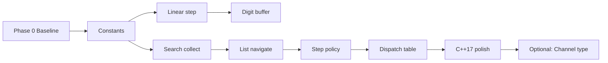

# 07. TVController 모던 C++ 리팩토링 계획 보고서

## 개요

- 대상 프로젝트: TDD TV C++17 프로젝트
- 작성·갱신 파일: `README.md` (「TVController 모던 C++ 리팩토링 계획」절), `include/TVController.h` (분석 대상, **미구현**)
- 목적: Green 상태(`05` 구현·`06` Golden Master)를 전제로 `TVController`의 **동작 변경 없는** 모던 C++ 리팩토링을 Phase 0~9+로 쪼개고, 커밋 단위·검증 방법·체크리스트를 문서화
- 작성일: 2026-05-19
- 작성 역할: 모던 C++ 리팩토링 코치 관점

## 작업 범위

`05_tv_controller_implementation_report.md`에서 header-only로 Green이 된 `TVController`와 `06_golden_master_test_report.md`의 Golden Master 32건을 **회귀 기준**으로 유지한다. 본 보고서는 **계획·문서화**만 수행하며, Phase 1 이후 실제 코드 리팩토링은 별도 커밋에서 진행한다.

| 제약 | 내용 |
|------|------|
| 채널 범위 | 0~99 (`docs/requirements_analysis.md` §3) |
| 진행 조건 | 각 Phase 완료 후 `cmake --build` + `ctest` **77/77 Green** |
| 범위 제외 | 100 이상·음수 채널 차단 → Phase 9+ (새 TDD 필요) |
| Golden | `setTunerCh`의 `std::cout` 문자열 변경 시 `update-golden` 필요 |

## 현황 분석 (`include/TVController.h`)

| 영역 | 핫스팟 | 리팩토링 방향 |
|------|--------|----------------|
| 매직 넘버 | `99`, `0`, `2`, `-1` | `constexpr` 상수·`ChannelPolicy` |
| 숫자 입력 | `handleDigit` / `handleOk` 중복 | `DigitInputBuffer` + 단일 확정 경로 |
| 업/다운 | `channelUp`/`Down` 이중 분기 | 전략(`Linear` vs `SearchList`) |
| 검색 | `performSearch` 중첩 `if` | 종료 조건 predicate 분해 |
| 디스패치 | `pushButton` early-return + `switch` | 키→핸들러 테이블 |
| 상태 | `navigationBase = -1` | `std::optional<int>` (C++17) |

### 베이스라인 테스트 (계획 수립 시점)

| 대상 | 결과 |
|---|---|
| `TunerTest` | 13/13 |
| `TVControllerTest` | 32/32 |
| `TVControllerGoldenTest` | 32/32 |
| **전체 `ctest`** | **77/77** |

```powershell
cmake --build build
ctest --test-dir build --output-on-failure
```

## Phase별 리팩토링 계획 요약

### Phase 0 — 베이스라인 고정

- 코드 변경 없음. 77/77 Green 확인 후 git baseline 기록 권장.

### Phase 1 — 채널·입력 상수화 (커밋 1)

- `include/ChannelPolicy.h` 또는 `namespace tv`에 `kMinChannel`, `kMaxChannel`, `kMaxDigitLength` 등 `inline constexpr` 정의.
- `channelUp`/`channelDown`/`handleDigit`의 리터럴 치환.
- **검증:** 경계 0·99, `07` 정규화, 업/다운 순환 대표 테스트.

### Phase 2 — 선형 채널 이동 함수 분해 (커밋 2)

- `stepLinearChannel(current, delta)`로 0↔99 순환 중복 제거.
- 검색 목록 **없을 때만** 적용.
- **검증:** README §5 업/다운(검색 없음) 5건.

### Phase 3 — 숫자 입력 버퍼 타입 분리 (커밋 3)

- `DigitInputBuffer` 캡슐화, `commitBufferedChannel()` 단일 경로.
- **검증:** §1 숫자·`456+UP` 버퍼 무효화. **리스크: 중간.**

### Phase 4 — 검색 수집 로직 분해 (커밋 4)

- `shouldStopSearch()` predicate, 수집 중 dedup + 마지막 `sort`.
- **`seekCH()` 호출 순서 불변** 유지 (Mock `InSequence`).
- **검증:** §4 검색 5건.

### Phase 5 — 검색 목록 네비게이션 통합 (커밋 5)

- `navigateSearchList` 방향 분기를 modulo 인덱스로 통합.
- **검증:** §6 업/다운(검색 있음) 5건.

### Phase 6 — 업/다운 전략 분리 (커밋 6) ★ 핵심

- `IChannelStepPolicy` / `LinearStepPolicy` / `SearchListStepPolicy`.
- `navigationBase`·`resolveNavigationChannel`는 `NavigationContext` 검토.
- **검증:** §5+§6 + `navigationBase` 회귀. **리스크: 높음.**

### Phase 7 — `pushButton` 디스패치 테이블 (커밋 7)

- 숫자/`OK` early-return 유지, 나머지 `unordered_map` 또는 `array` 핸들러.
- **검증:** Controller 32 + Golden 32.

### Phase 8 — C++17 정리 (커밋 8)

- `std::optional` for `navigationBase`, 토글·파싱 단일화.
- **검증:** 선호 채널 §2+§3 (10건).

### Phase 9+ — (선택) 타입 강화·`.cpp` 분리·유효성 검증

- `Channel` 강타입, `TVController.cpp` 분리, 범위 밖 `setCH` 정책 — **새 테스트 후 TDD.**

## Phase 요약 체크리스트

| Phase | 커밋 요약 | 주요 검증 | Green 필수 |
|-------|-----------|-----------|------------|
| 0 | 베이스라인 | 77/77 | ✓ |
| 1 | 상수화 | 숫자·0/99 | ✓ |
| 2 | `stepLinearChannel` | §5 | ✓ |
| 3 | `DigitInputBuffer` | §1·456+UP | ✓ |
| 4 | `performSearch` 분해 | §4 | ✓ |
| 5 | 목록 네비 | §6 | ✓ |
| 6 | Step policy | §5+§6 | ✓ |
| 7 | 핸들러 테이블 | 32+32 | ✓ |
| 8 | optional·토글 | §2+§3 | ✓ |
| 9+ | Channel·검증 | 새 테스트 | ✓ |

## 권장 진행 순서



**주의:** Phase 3(버퍼)와 Phase 6(전략)을 **한 커밋에 합치지 않는다.**

## 실패 시 빠른 진단

| 실패 패턴 | 의심 지점 |
|-----------|-----------|
| `456` + `UP` | 버퍼 클리어 vs `navigationBase` |
| 검색 Mock `Times` | `performSearch` 루프·종료 순서 |
| Golden diff | `setTunerCh` cout 문자열 |
| 채널 15 업/다운 | 목록 밖 → front/back |

## C++17 스타일 체크리스트 (Phase 1~8)

- [ ] `inline constexpr` (`ChannelPolicy`)
- [ ] `std::optional<int>` (센티널 `-1` 제거)
- [ ] `enum class` (Step, Handler)
- [ ] 구조적 바인딩 (필요 시)
- [ ] `[[nodiscard]]` on helpers
- [ ] `switch` → map/array (Phase 7)

## README 반영

`README.md` 파일 끝에 **「TVController 모던 C++ 리팩토링 계획」** 절을 추가하였다. Test Case To-Do List·Golden Master 절과 별도로, Phase 0~9+ 전체(목표·작업·코드 스케치·검증 테스트·체크리스트·mermaid·진단표)를 프로젝트 내 단일 참조 문서로 유지한다.

## QA·개발 관점 기대 효과

- Green 유지하며 커밋 단위로 구조 개선 가능 — 회귀 범위가 Phase별로 한정된다.
- Mock 단위 테스트 + Golden stdout 이중 안전망으로 리팩토링 신뢰도를 높인다.
- `requirements_analysis.md`와 README TDD 요구를 코드 구조(정책·버퍼·전략)에 1:1 매핑할 수 있다.
- Phase 9+로 무효 채널 정책을 분리해, 리팩토링과 기능 확장 TDD를 분리한다.

## 생성·수정 파일

- `README.md` (리팩토링 계획 절 추가, 약 387행)
- `Report/07_tv_controller_refactoring_plan_report.md`
- `Prompting/07_tv_controller_refactoring_plan_report-Prompt.md`

## 후속 작업

1. Phase 0 baseline 커밋(또는 태그) 후 Phase 1부터 순차 적용
2. Phase 6 완료 시 `navigationBase`·연속 UP/DOWN 시나리오 집중 회귀
3. Phase 9+ 착수 전 `100`/`음수` Controller 테스트 Red 작성
