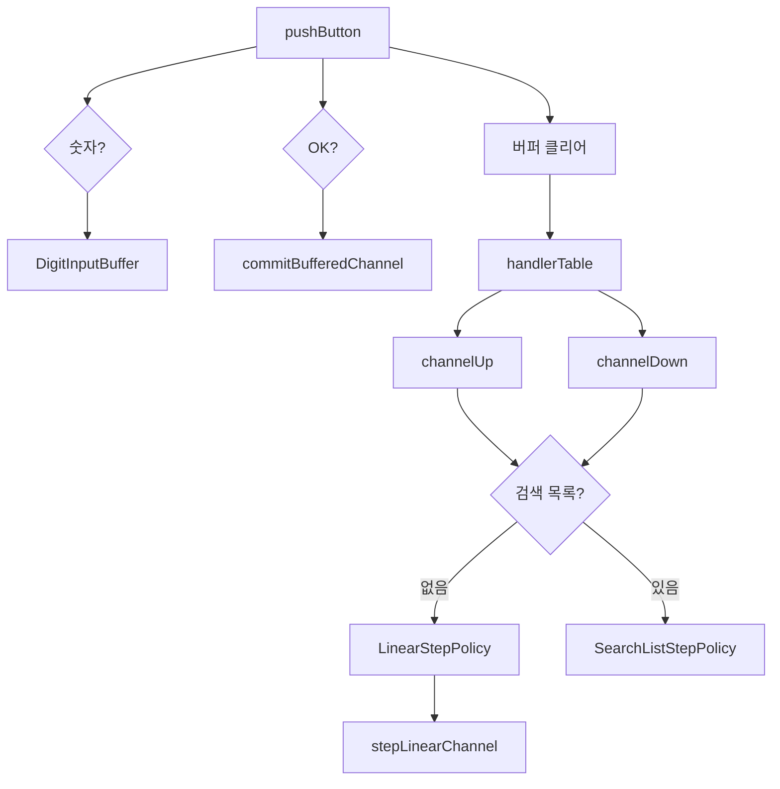

# 08. TVController 모던 C++ 리팩토링 구현 보고서

## 개요

- 대상 프로젝트: TDD TV C++17 프로젝트
- 작성·갱신 파일: `include/TVController.h`, `include/ChannelPolicy.h`, `include/DigitInputBuffer.h`
- 목적: `README.md` 「TVController 모던 C++ 리팩토링 계획」Phase 0~8을 **동작 변경 없이** 구현하고 77/77 Green 유지
- 작성일: 2026-05-19
- 작성 역할: 모던 C++ 리팩토링 개발 (TDD Green 유지)
- 선행 문서: `07_tv_controller_refactoring_plan_report.md`, `05_tv_controller_implementation_report.md`, `06_golden_master_test_report.md`

## 작업 범위

| 제약 | 내용 |
|------|------|
| 채널 범위 | 0~99 (`docs/requirements_analysis.md` §3) |
| 진행 조건 | Phase 0 베이스라인 확인 후 Phase 1~8 일괄 적용, 최종 `ctest` **77/77 Green** |
| 범위 제외 | Phase 9+ (Channel 강타입, `.cpp` 분리, 무효 채널 검증) — 별도 TDD 후 진행 |
| Golden | `setTunerCh`의 `std::cout` 문자열 **변경 없음** → `update-golden` 불필요 |

`Tuner`·`remoteKey.h`·테스트 코드는 변경하지 않았다. 리팩토링은 Controller 헤더 및 신규 헤더 2개에 한정한다.

## Phase별 구현 결과

### Phase 0 — 베이스라인 고정

| 항목 | 결과 |
|------|------|
| `cmake --build build` | 성공 |
| `ctest --test-dir build` | **77/77** Green (리팩토링 전) |

### Phase 1 — 채널·입력 상수화

- **신규:** `include/ChannelPolicy.h`
  - `tv::kMinChannel` (0), `tv::kMaxChannel` (99), `tv::kChannelCount` (100), `tv::kMaxDigitLength` (2)
- `handleDigit` 2자리 확정, 업/다운 순환에 상수 적용

### Phase 2 — 선형 채널 이동 함수 분해

- **추가:** `namespace tv::stepLinearChannel(current, delta)`
- 99→0, 0→99 순환을 단일 함수로 통합
- 검색 목록 없을 때 `LinearStepPolicy`에서 사용

### Phase 3 — 숫자 입력 버퍼 타입 분리

- **신규:** `include/DigitInputBuffer.h`
  - `append`, `readyToCommit`, `tryTakeChannel`, `clear`
  - `[[nodiscard]]` on `empty`, `readyToCommit`, `tryTakeChannel`
- `handleDigit` / `handleOk` → `commitBufferedChannel()` 단일 확정 경로
- `setTunerCh` 시 버퍼 클리어 동작 유지

### Phase 4 — 검색 수집 로직 분해

- **추가:** `tv::SearchScanState`, `tv::shouldStopSearch()`
- 수집 중 `std::unordered_set<int>` dedup, 종료 후 `std::sort` (정렬 순서 유지)
- `seekCH()` 호출 순서·횟수 Mock 기대와 일치 (§4 테스트 5건 Green)

### Phase 5 — 검색 목록 네비게이션 통합

- **추가:** `enum class NavStep { Up, Down }`, `navStepDelta()`
- `SearchListStepPolicy::step()`에서 `(index + size + delta) % size` 통합
- 목록 밖 현재 채널 → `front` / `back` 분기 유지

### Phase 6 — 업/다운 전략 분리 ★

- **추가:** `IChannelStepPolicy`, `LinearStepPolicy`, `SearchListStepPolicy`
- `channelUp` / `channelDown`: `searchResults_.empty()` ? linear : searchList
- `NavigationContext` + `resolveNavigationContext()` — `channelDown` 시 `navigationBase_` 우선
- `456+UP` 시나리오: 버퍼 무효화 + `navigationBase_` 타이밍 동일 유지

### Phase 7 — `pushButton` 디스패치 테이블

- 숫자 / `KEY_OK` early-return 유지
- 나머지: `std::unordered_map<remoteKey, Handler>` + `dispatchNonDigitKey()`
- 핸들러: UP, DOWN, SEARCH, FAVORITE_ADD, FAVORITE_NEXT

### Phase 8 — C++17 정리

| 항목 | Before | After |
|------|--------|-------|
| `navigationBase` | `int`, `-1` 센티널 | `std::optional<int>` |
| 채널 파싱 | `getCurrentChannel()` | `parseTunerChannel()` |
| 선호 토글 | if/erase/insert 분기 | `find` + erase/insert |
| `goToNextFavorite` | 인라인 분기 | `target` 변수로 명시 |

## 아키텍처 요약



## 테스트 결과 (Green)

| 대상 | 결과 |
|------|------|
| `TunerTest` | 13/13 |
| `TVControllerTest` | 32/32 |
| `TVControllerGoldenTest` | 32/32 |
| **전체 `ctest`** | **77/77** |

```powershell
cd c:\DEV\TDD_TV_14
cmake --build build
ctest --test-dir build --output-on-failure
```

Golden Master: stdout 트랜스크립트 diff 없음 (`update-golden` 미실행).

### Phase별 대표 검증 테스트 (모두 통과)

| Phase | 대표 테스트 |
|-------|-------------|
| 1 | `should_set_channel_99_when_digits_9_and_9`, `should_wrap_to_0_when_up_from_99_without_search` |
| 2 | `should_go_to_7_and_5_when_up_and_down_from_6_without_search` |
| 3 | `should_set_channels_45_then_6_when_digits_4_5_6_and_ok`, `should_confirm_45_only_when_key_up_after_digits_4_5_6` |
| 4 | `should_deduplicate_duplicate_seek_results`, `should_invoke_seekch_when_search_pressed` |
| 5 | `should_go_to_14_and_4_when_up_down_from_6_on_search_list` |
| 6 | §5+§6 업/다운 10건 + `456+UP` |
| 7 | Controller + Golden 전체 64건 |
| 8 | 선호 채널 §2+§3 (10건) |

## C++17 스타일 체크리스트 (Phase 1~8)

- [x] `inline constexpr` (`ChannelPolicy.h`)
- [x] `std::optional<int>` (`navigationBase_`)
- [x] `enum class` (`NavStep`)
- [x] `[[nodiscard]]` (`DigitInputBuffer` 조회 메서드)
- [x] `switch` → `unordered_map` 핸들러 (Phase 7)
- [ ] 구조적 바인딩 — 미적용 (필요 시 Phase 9+)
- [ ] `std::string_view` — Tuner API가 `std::string` (Phase 9+ 검토)

## 생성·수정 파일

| 파일 | 변경 |
|------|------|
| `include/ChannelPolicy.h` | **신규** — 채널 0~99 정책 상수 |
| `include/DigitInputBuffer.h` | **신규** — 숫자 입력 버퍼 |
| `include/TVController.h` | **전면 리팩토링** (~226행 → ~285행, 정책·전략·디스패치 분리) |

## 설계 결정

1. **header-only 유지** — Phase 9+에서 `.cpp` 분리 검토. 현재 테스트는 include만으로 빌드되므로 분리하지 않음.
2. **`namespace tv`** — 정책·전략·검색 헬퍼를 `TVController` 밖으로 분리해 단일 책임 유지.
3. **가상 `IChannelStepPolicy`** — Phase 6에서 검색 유/무 분기 단순화. 인스턴스는 스택(`SearchListStepPolicy`) 또는 멤버(`linearPolicy_`)로 수명 관리.
4. **동작 불변** — `setTunerCh` cout, `seekCH` 순서, `navigationBase` DOWN 전용 의미를 기존 `05` 구현과 동일하게 유지.

## QA·개발 관점 기대 효과

- 매직 넘버·중복 분기 제거로 요구사항(`requirements_analysis.md`)과 코드 구조 1:1 매핑이 쉬워졌다.
- Mock + Golden 이중 안전망 하에 Phase 9+ (무효 채널·강타입) TDD를 독립적으로 진행할 수 있다.
- `DigitInputBuffer`·`IChannelStepPolicy` 단위로 향후 단위 테스트 추가가 용이하다.

## 후속 작업 (Phase 9+)

1. `Channel` 강타입 (`explicit Channel(int)` + `isValid()`)
2. `TVController.cpp` 구현 분리 (헤더 비대화 해소)
3. `setTunerCh`에서 `kMinChannel`~`kMaxChannel` 검증 — **Red 테스트 작성 후 TDD**
4. Phase별 git 커밋 분리(이번 작업은 일괄 적용) — 향후 Phase 단위 커밋 권장

## 관련 문서

- `README.md` — 「TVController 모던 C++ 리팩토링 계획」절
- `Report/07_tv_controller_refactoring_plan_report.md` — 계획 수립 보고서
- `Prompting/08_tv_controller_refactoring_implementation_report-Prompt.md` — 본 작업 대화형 transcript
